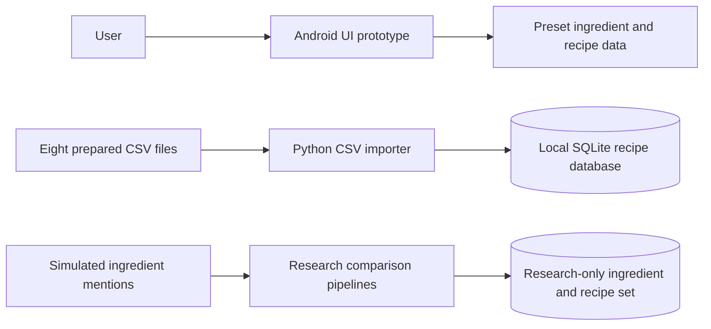
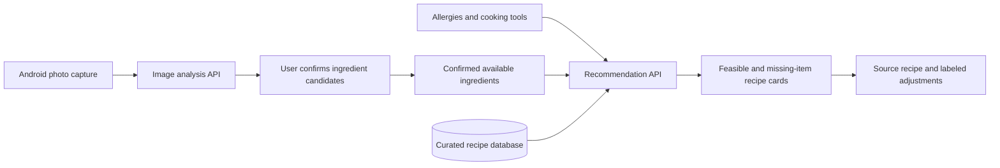
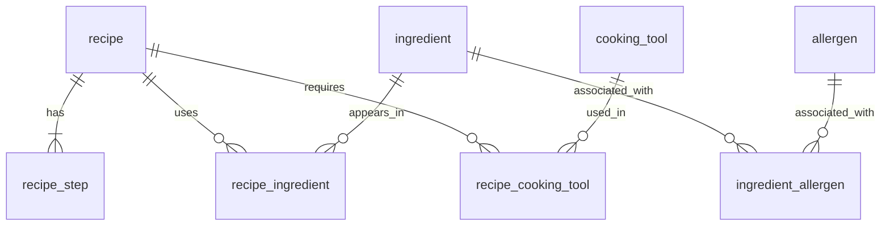

# My Little Chef — Design Documentation

**Team 15 · Iteration 1 · 2026-10-09 · version 0.3**

**Languages:** [English](design-documentation.en.md) · [한국어](design-documentation.ko.md)
**Scope:** Implemented prototypes and proposed integration are labeled separately. API and model choices remain open.

## Document Revision History

| Version | Date | Changes |
| --- | --- | --- |
| 0.1 | 2026-09-30 | Initial design based on the proposal and early recognition and recipe research. |
| 0.2 | 2026-10-07 | Incorporated the Android prototype, recipe database, and TA feedback; separated current components from the proposed integration. |
| 0.3 | 2026-10-09 | Refined the architecture, data model, draft interfaces, technology choices, and integration limits. |

## 1. Scope and Current System State

My Little Chef aims to turn a user's confirmed ingredients, cooking tools, and allergy restrictions into practical one-serving recipe recommendations. Iteration 1 produced three separate artifacts:

1. An Android prototype that demonstrates onboarding, profile editing, capture/manual entry, mock ingredient analysis, a digital refrigerator, recipe cards/details, and favorites. Its analysis response and recipes are preset data; it does not call a production recognition or recommendation service.
2. A SQLite recipe-data prototype with an eight-table schema and CSV importer. It contains source recipes, steps, ingredient names, and recipe-ingredient rows, but it has not been connected to the Android client.
3. A Python research branch comparing ingredient-name normalization and recommendation ideas using simulated recognition strings and a small research recipe set. Its reported diagnostic metrics are not measurements of the Android app on real refrigerator images.

The following sections first document what exists, then mark proposed contracts and technologies for Iteration 2. A design candidate is not a deployment claim.

## 2. System Architecture and Data Flow

### 2.1 Iteration 1 component boundaries

The arrows above are implemented or directly represented in the current branches. There is no Android-to-server arrow in Iteration 1 because no integrated API call has been confirmed.

### 2.2 Proposed integration path

The team meeting identified two server operations:

The Android client should remain responsible for user input, correction, navigation, and display. A server would receive an image and return candidate ingredients for review; separately, it would receive the confirmed inventory and profile constraints and return ranked recipes. The exact framework, inventory persistence location, authentication approach, and final API schemas have not been selected.

### 2.3 Draft interface contracts

These examples are **design proposals**, not implemented endpoints. Their purpose is to make the Android/server handoff reviewable.

| Operation | Draft request | Draft response | Required failure behavior |
| --- | --- | --- | --- |
| Analyze image | Photo and optional client request ID | Candidate ingredient ID/name, source text, confidence or uncertainty indicator | Clear error or empty-candidate response; user can retry or enter manually |
| Recommend recipes | Confirmed ingredient IDs, available tools, allergy restrictions, optional filters | Ranked recipe IDs, ready/missing status, missing items/tools, explanation | Empty result explains why; unknown allergy metadata must not be labeled safe |

An analysis response must remain **unconfirmed** until the user reviews it. The server must not silently treat a guessed ingredient as owned. The recommendation request should use confirmed ingredient IDs instead of raw image labels to avoid different spellings in the recipe database.

## 3. Android Client

The Android branch follows a screen and ViewModel structure. It includes navigation, onboarding/profile screens, camera preview or gallery access, manual ingredient entry, a mock analysis screen, refrigerator view, recipe list/detail screens, and favorites. The observed demo exercises a successful mock flow on a physical phone.

The current Gradle project uses Kotlin, Jetpack Compose with Material 3, AndroidX Navigation and Lifecycle, CameraX for camera preview, and Coil Compose for image display. `MainActivity` is the entry point, `AppNavHost` owns screen navigation, and `FridgeViewModel`/`UserViewModel` hold UI state. The current `AnalyzeScreen` waits two seconds and displays `Preset.analyzeResult`; it does not infer from pixels. The declared `minSdk` is 36, so device coverage should be reviewed before broader deployment.

Current limits relevant to design:

- The analysis screen returns preset ingredients after a delay; it does not infer ingredients from camera pixels.
- Recipe cards use sample recipes rather than the 537-row SQLite dataset.
- Inventory/profile values are held in app state and are not confirmed as persistent across restarts or synchronized with a server.
- The current UI does not provide a verified allergy filter, tool feasibility check, one-serving conversion, or complete empty/error states.
- Duplicate ingredient entries can occur when manual and mock-detected items are both added; confirmed items need a canonical identity and merge rule.

The Iteration 2 client design should keep the current user confirmation step while replacing preset responses with the two server operations. The team should decide whether pantry data is stored locally (for example, with Room) or on the server before implementing persistence; both require a clear update and deletion contract.

## 4. Recipe Database and Data Model

### 4.1 Source and import

The source datasets are the public recipe basic information, process information, and ingredient information supplied through the agricultural data portal. The ingredient file was obtained after a download request to the provider. The team converted these inputs into eight entity CSV files and imports them with `server/db/import_recipes.py` on the DB branch. The source CSVs are supplied separately and are not currently committed to the code repository.

The importer checks headers, positive integer IDs, string lengths, and foreign keys. Empty values become SQL `NULL`. It creates a new database and refuses to overwrite an existing one. The current local prototype contains **537 recipes, 2,870 steps, 701 distinct ingredient names, and 5,933 recipe-ingredient rows**. Tool, recipe-tool, allergen, and ingredient-allergen tables exist but have no data.

### 4.2 Current relational structure

`recipe_ingredient` has its own primary key (`recipe_ingredient_id`) because the same ingredient can occur more than once in one recipe with different source quantities or categories. `ingredient.name` removes bracketed preparation-group prefixes for matching, while `recipe_ingredient.original_name` keeps the original source label. `quantity_text` retains raw strings such as `200g` and `약간`; eight source rows have no amount. `ingredient_type_code` retains the provider's main/secondary/seasoning classification. This classification does not establish whether an ingredient is essential or which cooking step consumes it.

The source's recipe and step image URL fields cannot be relied upon. The provider indicated those URLs are unused. Representative images for selected recipes must be collected separately with appropriate source and reuse checks.

### 4.3 Data preparation required for one-person meals

The raw 537 recipes are a source pool, not a curated one-serving product set. Before a recipe can be marked immediately cookable, the team needs to select a practical subset and review: required versus optional ingredients, cooking tools, allergy metadata, source/attribution, instructions, quantity units, serving counts, and whether scaling to one serving is meaningful. Text such as `약간` or a missing source amount cannot be converted by simple arithmetic. The service should display source amounts or mark a conversion unavailable until the curated rule is verified.

## 5. Recognition, Normalization, and Recommendation

### 5.1 Research results and their limits

The research branch contains P0–P5 reference pipelines for fixed-vocabulary matching, open-tag normalization, sibling-ingredient disambiguation, clutter gating, and constraint-aware ranking. The benchmark uses simulated recognition strings and a small research dataset that is separate from the 537-recipe SQLite database. Several reported metrics depend on the diagnostic setup or fixed values in the research code. They must be presented as **research diagnostics**, not real-photo detector recall, full application latency, or a guarantee of allergy safety.

The useful design ideas are: normalize labels to canonical ingredient IDs, let users review uncertain candidates, apply hard constraints before ranking, and explain missing conditions. The exact model/provider is unresolved. The Wiki's Gemini-based diagram is one candidate from the research phase; the course-provided OpenAI API key is another possible project resource with a limited budget. No image model is established as the production implementation.

### 5.2 Proposed recommendation order

1. Start from the selected, curated recipe subset with reliable metadata.
2. Apply known allergy restrictions. If metadata is missing, do not claim that the recipe is verified safe.
3. Check required cooking tools and essential ingredients.
4. Classify each candidate as cookable now, cookable after a clearly labeled approved adjustment, or requiring additional items/tools.
5. Rank within a class using missing essentials, ingredient reuse, practical cooking time, and the user's chosen filters. Do not let a seasoning-only overlap make an infeasible main meal appear ready.
6. Return an explanation with each card. A refresh action may show another eligible candidate but must retain the same hard constraints.

The ordering of optional factors and the minimum acceptable candidate pool remain open design decisions. A rule such as “one matched core ingredient” alone is not enough to prove that a recipe can be cooked.

### 5.3 Constrained recipe adjustments

The source recipe remains immutable in the UI and data model. A proposed adjustment should be a separate record containing the original value, proposed value, reason, and provenance. The team discussed scaling a source recipe to one serving and replacing a missing ingredient with a similar, approved ingredient. Any AI suggestion must be checked against allergies, essential ingredients, available cooking tools, and food-safety-critical steps before being offered. The exact substitution list and the role of an external language model need a team decision; this feature is not yet implemented.

## 6. Technology Decisions Under Consideration

| Topic | Current state | Decision needed for Iteration 2 |
| --- | --- | --- |
| Backend framework | No integrated backend API in the repository | Compare FastAPI's API-first Python workflow with Django's integrated ORM/admin/auth workflow against the two proposed operations |
| Recipe DBMS | SQLite schema/import prototype works locally | Keep SQLite for the first integrated prototype or migrate to PostgreSQL when concurrent server needs justify it |
| ORM | Raw SQL/import script; no ORM models | Select SQLAlchemy or Django ORM after backend choice and map the existing schema |
| Inventory persistence | Android in-memory state | Choose local persistence or server-backed state and define update/conflict behavior |
| Image recognition | Mock analysis UI plus simulated-input research | Run real-photo feasibility measurements, then select an external vision API or detector and a manual-confirmation fallback |
| Course servers | GPU access is limited and cannot directly serve external clients; CPU serving setup is pending | Decide whether CPU hosts the API and database, and whether GPU is needed for experiments or inference |

These are decisions to evaluate, not technology commitments. The external API key must be stored on the server if used; it must not be included in the Android app.

## 7. Iteration 1 Learnings and Iteration 2 Work

Iteration 1 showed that a usable Android navigation/demo flow and a structured recipe import can be prepared independently. It also showed a gap between the research examples and real refrigerator recognition, and between raw recipe data and one-serving, tool-aware recommendations. The ingredient provider's image URL fields cannot supply recipe images. The team received TA feedback to make the app's single-person-household purpose measurable, compare registration convenience with accuracy, and keep meetings and schedule changes traceable.

The next integration sequence should be:

1. Agree on request/response/error contracts for image analysis and recipe recommendation.
2. Choose a small curated recipe set and add tool, allergy, essential-ingredient, and one-serving information.
3. Measure candidate recognition methods on real photographs, including packaging, overlap, poor lighting, and hard-to-see seasonings. Consider a persistent seasoning checklist or manual confirmation for items photographs cannot reliably show.
4. Connect Android confirmation to persistent inventory and a real recommendation endpoint.
5. Add explicit empty/error states and evaluate whether a recommended meal is actually cookable with the user's ingredients and tools.
6. Introduce refresh, approved substitutions, and optional “one additional ingredient unlocks…” suggestions only after the baseline recommendation constraints are reliable.

Detailed test cases and measured results belong in separate testing documentation. This section records design consequences and the implementation order.
