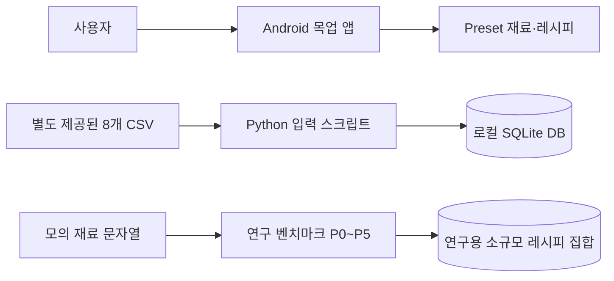
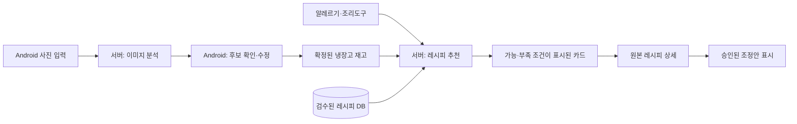
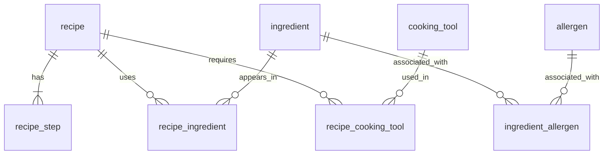

# My Little Chef — 설계 문서

**Team 15 · Iteration 1 · 2026-10-09 · v0.3**

**언어:** [English](design-documentation.en.md)

## 1. 개정 이력

| 버전 | 날짜 | 주요 변경 |
| --- | --- | --- |
| 0.1 | 2026-09-30 | 제안서와 초기 인식·레시피 연구를 바탕으로 설계 방향 작성 |
| 0.2 | 2026-10-07 | Android 시제품, 레시피 DB, TA 피드백을 반영하고 현재 구성과 통합안을 구분 |
| 0.3 | 2026-10-09 | 아키텍처, 데이터 모델, API 초안, 기술 선택과 통합 범위를 구체화 |

## 2. 시스템 범위와 현재 상태

목표 시스템은 Android 앱에서 식재료를 촬영하고 사용자가 인식 후보를 확인한 뒤, 확정된 재고와 조리도구·알레르기 정보를 서버에 전달해 레시피를 추천받는 구조다. Iteration 1의 실제 결과는 다음 세 갈래로 나뉜다.

| 영역 | 실제 결과 `[현재]` | 아직 없는 연결 |
| --- | --- | --- |
| Android | 화면 이동, 카메라/갤러리 입력, 수동 등록, 가상 분석 결과, 냉장고, 레시피 카드·상세, 프로필 UI | 이미지 분석 API 호출, 실제 레시피 DB 결과, 영속 재고 저장 |
| 레시피 데이터 | SQLite 스키마와 CSV 입력 스크립트, 기본·단계·재료 데이터 | 서버 ORM, 조리도구·알레르기 데이터, 1인분 변환, 앱 연동 |
| 연구 | P0~P5 후보 파이프라인과 모의 재료 문자열 벤치마크 | 실제 냉장고 사진 기반 인식 성능, 운영 모델 선택, API 연결 |

`main`에는 이 작업의 문서가 병합되어 있다. 기능 코드는 각각 `origin/feat/android-studio`, `feat/recipe-db-schema-import`, `feat/research-pipeline` 브랜치에 있으며 아직 `main`에서 하나의 앱·서버로 합쳐진 상태가 아니다. Android 원격 브랜치의 실제 이름은 `origin/feat/android-studio`라서 로컬 원격 추적 이름에 `origin/origin/`이 보인다.

## 3. 시스템 아키텍처

### 3.1 Iteration 1에서 확인된 관계 `[현재]`

이 구조에는 Android에서 서버로 향하는 실행 경로가 없다. 앱의 분석 화면은 2초 대기 후 `Preset.analyzeResult`를 보여준다. 따라서 시연 영상은 화면 흐름을 입증하지만 사진 인식이나 DB 추천의 성능 증거는 아니다.

### 3.2 다음 통합 구조 `[제안]`

서버를 **사진→후보 재료**와 **확정 재고·프로필→레시피**의 두 작업으로 나누는 방향은 10월 7일 회의에서 합의했다. 사용자가 후보를 확정하기 전에는 서버의 추정을 재고로 저장하지 않는다. Android는 입력·수정·화면 이동을 담당하고, 서버는 모델 호출·정규화·제약 필터·DB 조회를 담당하는 안을 검토 중이다.

## 4. Android 클라이언트 설계

현재 프로젝트는 Kotlin과 Jetpack Compose를 사용한다. `MainActivity`가 앱 진입점이고, `AppNavHost`와 화면별 Composable이 이동과 표시를 맡는다. `FridgeViewModel`, `UserViewModel`이 화면 상태를 보관한다. `AnalyzeScreen`은 `Preset` 재료를 사용하는 목업이다. `CameraX`는 카메라 화면, `Coil`은 이미지 표시, Navigation Compose는 화면 이동에 쓰인다.

| 라이브러리·구성 | 저장소에서 확인된 용도 |
| --- | --- |
| Kotlin, Jetpack Compose, Material 3 | Android UI 구성 |
| AndroidX Navigation Compose | 화면 이동 |
| AndroidX Lifecycle/ViewModel | 앱 화면 상태 |
| CameraX (`camera-core`, `camera-camera2`, `camera-lifecycle`, `camera-view`) | 촬영 화면 |
| Coil Compose | 선택한 이미지 표시 |

현재 Gradle 설정의 `minSdk`는 36이다. 실제 사용자 기기 범위를 넓힐 필요가 있는지 다음 iteration에서 검토해야 한다. 재고와 프로필은 앱 상태에 머무르므로 재시작 후 지속 여부가 보장되지 않으며, 서버 동기화도 없다. 사용자가 같은 식재료를 수동·분석 결과로 각각 추가할 때 중복되는 경우를 막기 위해 **표준 식재료 ID와 병합 규칙**이 필요하다.

## 5. 서버 경계와 API 계약 `[제안]`

아래 경로와 필드는 **협의를 위한 예시**다. 프레임워크·인증·영속 저장 방식·오류 코드는 아직 확정하지 않았다. Android와 서버 담당자가 먼저 성공·빈 결과·실패 응답을 함께 정해야 한다.

| 작업 | 예시 요청 | 예시 응답 | 실패·빈 상태에서 필요한 처리 |
| --- | --- | --- | --- |
| `POST /ingredients/analyze` | 이미지 파일, 선택적 요청 ID | 표준 재료 ID·표시명·원래 인식 문자열·불확실성 표시가 있는 후보 목록 | 파일 오류, 시간 초과, 후보 0개를 구분. 앱은 재시도·직접 입력 제공 |
| `POST /recipes/recommend` | 사용자가 확정한 재료 ID, 조리도구 ID, 알레르기 ID, 선택적 필터 | 정렬된 레시피 ID, 가능/부족 상태, 부족한 핵심 재료·도구, 추천 이유 | 가능한 요리 0개를 오류와 구분. 불완전한 알레르기 정보는 안전 보증으로 표시하지 않음 |

예시 요청의 핵심 원칙은 **이미지의 원시 문자열이 아닌 사용자가 확인한 표준 재료 ID로 추천을 요청한다**는 것이다. 이 방식은 ‘대파’, ‘흙대파 한 단’처럼 표현이 다른 입력을 DB 재료와 연결하기 쉽게 한다. 후보 목록에 모델의 신뢰 수치를 표시할지는 실제 모델의 출력이 확정된 뒤 정한다. 임의의 수치를 만들어 사용자에게 정확도로 제시해서는 안 된다.

재고 저장 위치는 `[미정]`이다. 기기 저장을 택하면 오프라인 편의성이 좋지만 기기 간 동기화가 어렵고, 서버 저장을 택하면 공유·복구가 쉬운 대신 인증과 네트워크 의존성이 커진다. 선택 후 추가·삭제·중복·동기화 충돌의 계약을 API에 명시해야 한다.

## 6. 레시피 DB와 데이터 모델 `[현재]`

농림축산식품부 공개 데이터에서 **레시피 기본정보·과정정보·재료정보**를 확보했다. 재료 파일은 제공기관의 다운로드 승인 후 받았다. 원본을 엔티티별 CSV 8개로 변환해 `server/db/import_recipes.py`가 SQLite DB에 입력한다. CSV와 생성 DB는 Git에 올리지 않고 별도로 관리한다.

| 테이블 | 역할 | 현재 행 수 |
| --- | --- | ---: |
| `recipe` | 이름, 분류, 인분 수, 출처 URL 등의 기본정보 | 537 |
| `recipe_step` | 조리 순서·설명·팁 | 2,870 |
| `ingredient` | 중복 제거한 표준 재료명 | 701 |
| `recipe_ingredient` | 레시피별 재료, 원본 양, 주재료·부재료·양념 구분 | 5,933 |
| `cooking_tool`, `recipe_cooking_tool` | 조리도구와 레시피 관계 | 0 |
| `allergen`, `ingredient_allergen` | 알레르겐과 재료 관계 | 0 |

`recipe_ingredient`는 관계 자체에 별도 기본키를 둔다. 같은 재료가 한 레시피 안에서 양이나 구분이 다르게 반복될 수 있기 때문이다. `ingredient.name`은 `[양념장]`과 같은 준비 그룹 접두어를 제거해 검색에 쓰고, `recipe_ingredient.original_name`에는 원문을 보존한다. `quantity_text`는 `200g`, `약간`처럼 원본 표현을 그대로 보관한다. 주재료·부재료·양념 구분은 **필수/선택 재료 구분도 아니고 조리 단계별 사용량도 아니다.**

SQLite 입력 스크립트는 Python 표준 라이브러리로 작성되었다. CSV 헤더·양의 정수 ID·문자열 길이·외래키를 검사하고, 기존 DB 덮어쓰기를 거부한다. 조리도구와 알레르기 테이블이 비어 있으므로 지금은 그 조건을 신뢰성 있게 적용할 수 없다. 제공기관은 대표 이미지 및 단계 이미지 URL 필드가 사용되지 않는다고 답했으므로 선정 레시피의 이미지는 별도 출처에서 수집해야 한다.

### 6.1 1인분용 정제 작업 `[제안]`

원본 537개는 서비스에 곧바로 노출할 집합이 아니라 **후보 풀**이다. 20~40개 정도의 자취 요리 후보를 고른 뒤 각 요리에 대해 다음을 검토한다.

1. 원본 인분 수와 양의 단위, `약간`·빈칸처럼 단순 비례 계산이 어려운 재료.
2. 핵심 재료와 빠져도 되는 재료, 대체 가능한 재료.
3. 필요한 조리도구와 초보자에게 현실적인 조리 시간·순서.
4. 알레르겐 정보와 표시 가능 범위, 이미지와 원본 출처.

검증되지 않은 변환량은 1인분 확정치로 표시하지 않는다.

## 7. 식재료 인식과 추천 설계

### 7.1 인식 후보와 사용자 확인

연구 브랜치는 고정 범주 인식, 열린 어휘 태그·임베딩, 비슷한 재료 구분, 비식품 후보 처리, 제약 기반 정렬 등 P0~P5 아이디어를 비교한다. 벤치마크 입력은 **이미지 자체가 아니라 모의 재료 문자열**이다. 일부 점수는 제한된 예제와 코드 내 설정에 의존한다. 따라서 Wiki에 제시된 수치를 실제 냉장고 사진 인식률, 앱 응답 시간 또는 알레르기 안전성으로 인용하지 않는다.

다음 단계에서 실제 사진으로 포장재·겹침·낮은 조도·소량 재료를 평가하고, 놓친 재료와 잘못 추가한 재료, 수정에 필요한 사용자 행동을 기록한다. 소금·설탕처럼 사진으로 식별하기 어려운 상비 재료는 체크 목록 또는 수동 입력을 검토한다. VLM API, 제한 범주 탐지기, 기기 내 모델 중 무엇을 택할지는 이 근거를 보고 결정한다.

### 7.2 추천 처리 순서 `[제안]`

1. 검수한 레시피 집합에서 시작한다.
2. 알려진 알레르기 충돌을 제외한다. 정보가 없는 요리를 안전하다고 표시하지 않는다.
3. 필요한 조리도구와 핵심 재료를 확인한다.
4. ‘바로 가능’, ‘승인된 조정 후 가능’, ‘추가 재료·도구 필요’를 구분한다.
5. 각 범주 안에서 부족한 핵심 재료 수, 보유 재료 활용, 조리 시간 등을 바탕으로 순서를 정한다. 양념만 몇 개 겹친 요리가 즉시 가능한 한 끼로 올라오지 않도록 한다.
6. 카드에 추천 이유와 부족한 조건을 반환한다. 새로고침은 같은 필수 제약을 유지한 다른 후보를 보여준다.

정렬 가중치와 ‘바로 가능’의 정확한 판정 규칙은 아직 미정이다. 연구 코드의 `matched_core >= 1`은 유용한 후보 조건일 수 있지만, 핵심 재료 한 개만 있다고 레시피 전체를 만들 수 있다는 뜻은 아니다.

### 7.3 AI 레시피 조정 `[후보]`

원본 레시피와 제안된 조정은 별도 데이터로 관리한다. 조정 항목에는 원본값, 제안값, 이유, 생성 방법, 검토 여부를 남긴다. 초기 범위는 **검수한 유사 재료의 치환과 1인분 양 조정** 정도로 제한하는 안을 검토한다. 알레르기 재료, 핵심 재료, 식품 안전에 영향을 주는 조리 단계는 검증 없이 바꾸지 않는다. 외부 AI가 후보를 제시하더라도 최종 필터와 표시 규칙은 별도로 적용해야 한다. 이 기능은 Iteration 1에서 구현되지 않았고, 팀이 범위를 정한 뒤 정식 요구사항에 넣어야 한다.

## 8. 기술 선택과 운영의 미결정 항목

| 주제 | 현재 상태 | 다음 결정에 필요한 근거 |
| --- | --- | --- |
| 백엔드 | 실행 중인 통합 API 없음 | 두 서버 작업에 맞는 FastAPI의 간결한 API 개발과 Django의 ORM·관리 기능을 비교 |
| DBMS·ORM | SQLite 스키마와 직접 SQL 입력 스크립트 | 우선 SQLite로 API 시제품을 만들지, 동시 사용·배포 요구에 따라 PostgreSQL로 옮길지. ORM은 프레임워크 선택 뒤 결정 |
| 재고 저장 | Android 앱 상태에 임시 보관 | 오프라인 사용, 기기 변경, 동기화·인증 요구를 비교 |
| 사진 분석 | 앱 목업과 문자열 기반 연구만 존재 | 실제 사진 평가 후 외부 비전 API 또는 탐지 모델 선택 |
| 서버 자원 | 수업에서 GPU·CPU 서버 제공 계획을 공지함 | GPU는 외부 직접 서빙 불가·사용 제한 가능. CPU 서버가 준비되면 API/DB 배치 확인 |
| 외부 AI 비용 | 수업 제공 예정 OpenAI API 키는 팀당 약 20달러 한도 | 프로젝트 용도에만 사용하고 서버에서 키를 보관; 요청당 비용과 사용량 제한 결정 |

기기와 서버 사이에는 요청·응답이 명확한 HTTP API를 우선 검토한다. 사진 후보와 추천은 각 요청에 결과를 돌려주는 흐름이므로 실시간 양방향 연결이 필요한지 아직 근거가 없다. 인증 방식과 사진 보관·삭제 정책은 재고 저장 위치 및 배포 환경을 결정할 때 함께 명시한다.

## 9. Iteration 2 구현 순서와 인수인계

1. Android·서버 담당자가 이미지 분석 및 추천의 정상·빈·오류 응답 예시를 합의한다.
2. 1인분 후보 레시피를 선정하고 핵심 재료·조리도구·알레르겐·출처를 정리한다.
3. 실제 사진으로 인식 방식을 비교하고 사용자 수정 부담을 기록한다.
4. 확정 재고 저장 위치를 정한 뒤 Android 목업 응답을 실제 API로 교체한다.
5. 레시피의 부족한 조건과 추천 이유를 화면에서 검증한다.
6. 기본 추천이 안정된 뒤 새로고침, 제한된 AI 조정, 추가 구매 제안을 단계적으로 도입한다.

세부 테스트 계획과 결과는 별도 Testing Documentation에 기록한다. 이 문서는 **구현 경계와 설계 판단**을 설명한다.
