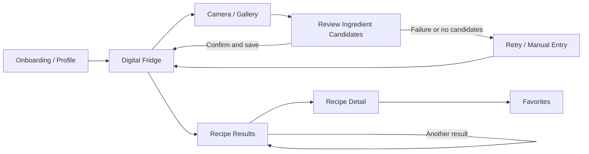

# My Little Chef — Requirements and Specifications

**Team 15 · Iteration 1 · 2026-10-09 · version 0.3**

**Languages:** [English](requirements-and-specifications.en.md) · [한국어](requirements-and-specifications.ko.md)
**Scope:** The requirements below describe the intended product. The Iteration 1 implementation evidence is stated separately.

## Document Revision History

| Version | Date | Changes |
| --- | --- | --- |
| 0.1 | 2026-09-30 | Initial requirements based on the proposal and early research: target users, ingredient registration, and recipe recommendations. |
| 0.2 | 2026-10-07 | Updated the scope using the Iteration 1 prototype, recipe data, and TA feedback on one-person meals and practical constraints. |
| 0.3 | 2026-10-09 | Refined six mandatory user stories, candidate features, and the UI flow. |

## Project Abstract

My Little Chef helps Korean students and other people living alone decide what they can cook with ingredients and tools they already have. A user photographs a refrigerator shelf or a group of groceries, reviews the proposed ingredient names, and saves the confirmed items to a digital refrigerator. The user also records available cooking tools and allergy restrictions. The application searches source-grounded recipes and distinguishes dishes that can be prepared now from dishes that require additional ingredients. It favors practical one-serving meals for small kitchens and explains why each recipe appears, including missing ingredients and required tools. Recipe details preserve the source instructions. Any proposed change to ingredients or serving size must be shown separately from the original recipe and must respect allergy and food-safety restrictions. The first prototype demonstrates the mobile flow with mock recognition and sample recipes. Later iterations must connect the Android client to a real recognition service and recipe database, prepare reliable one-serving amounts and tool mappings, and evaluate whether suggested meals are actually cookable. The product aims to reduce ingredient-entry effort and avoid recommendations that are impractical for a beginner cook living alone.

## Customers and Use Context

The general audience is anyone who wants meal ideas from food already at home. The primary users are Korean university students and other single-person households with small refrigerators, limited cooking tools, limited portions, and little cooking experience. A secondary user is someone who has an allergy restriction and needs the application to avoid unsupported safety claims.

Two common occasions are: (1) deciding what to cook after opening the refrigerator, and (2) registering a few newly purchased ingredients without re-entering the entire inventory. The product should not require a perfect photograph or a complete inventory before the user can continue.

## Competitive Landscape

Samsung Food+ already describes photo-based ingredient scanning, a food list, recipe search using available ingredients, and AI recipe personalization. The Korean app Naenggo advertises photo or text ingredient input and AI recipe recommendations. My Little Chef therefore does **not** claim those individual features are new. Its intended focus is the combined decision: *Can a beginner living alone make this one-serving Korean meal now, with their confirmed ingredients, available cooking tools, and allergy restrictions?* The application should show the missing conditions and keep any adjustment separate from the source recipe. This is a proposed product direction, not a claim that these functions have already been implemented or that competitors cannot provide them.

| User need | Samsung Food+ | Naenggo | My Little Chef requirement |
| --- | --- | --- | --- |
| Register ingredients from a photo | Documented | Advertised | Reviewable candidates plus manual correction |
| Discover recipes from available food | Documented | Advertised | Rank meals by confirmed ingredients and missing essentials |
| Account for limited cooking tools | Not assessed here | Not assessed here | Filter or clearly flag unavailable tools |
| Show a practical one-serving source recipe | Not assessed here | Not assessed here | Provide one-serving quantities with source attribution |
| Explain a constrained recipe adjustment | AI personalization documented; behavior differs by product | Not assessed here | Label changes and apply explicit safety restrictions |

Sources: [Samsung Food+](https://samsungfood.com/food-plus/), [Samsung Food Help: ingredient-based search](https://support.samsungfood.com/hc/en-us/articles/30251599415956-How-to-Search-for-Recipes-Using-Your-Available-Ingredients), [Naenggo on Google Play](https://play.google.com/store/apps/details?id=com.naengo.app).

## Functional Requirements

US-01 to US-06 are the team's proposed mandatory stories for the completed product. The Iteration 1 prototype does not yet satisfy every criterion. The course requires every mandatory story to be implemented by the end of the project, so the team should narrow any story it cannot commit to delivering.

### US-01 — Set cooking constraints

**As a** beginner cook, **I want** to save my cooking tools and allergy restrictions, **so that** recipe results reflect what I can safely make in my kitchen.

- **Given** a first-time user, **when** they finish onboarding with selected tools and allergies, **then** the application saves those selections and shows them when the profile is reopened.
- **Given** a user changes a restriction, **when** they request recommendations again, **then** the new selection is used for those recommendations.

### US-02 — Review recognized ingredients

**As a** user with food in my refrigerator, **I want** to photograph several items and correct recognition results before saving them, **so that** incorrect detections do not silently affect my inventory.

- **Given** a photograph has been analyzed, **when** candidate ingredients are returned, **then** the user can confirm, remove, or manually add items before saving.
- **Given** recognition fails or returns no useful candidates, **when** the result screen appears, **then** the user can retry or enter an ingredient manually.

### US-03 — Maintain an available-ingredient list

**As a** user, **I want** to see and edit the ingredients I currently have, **so that** later recommendations use the corrected list.

- **Given** confirmed ingredients, **when** the user saves them, **then** they appear in the digital refrigerator without unintended duplicate entries.
- **Given** an ingredient is no longer available, **when** the user removes it, **then** subsequent recommendations no longer treat it as owned.

The refined proposal uses **availability** for the MVP. Tracking exact remaining amounts is an open requirement after the TA discussion; the team must decide how users would enter and update quantities before adding quantity-specific acceptance criteria.

### US-04 — Find feasible recipes

**As a** person living alone, **I want** recipe results to account for my ingredients, allergies, and cooking tools, **so that** the app does not present an unsuitable dish as immediately cookable.

- **Given** confirmed ingredients and user constraints, **when** the user opens recommendations, **then** each result indicates whether it can be prepared now or which ingredients or tools are missing.
- **Given** a known allergy conflict, **when** recommendations are produced, **then** the conflicting recipe is excluded from the safe candidate set.
- **Given** no feasible recipe, **when** results are shown, **then** the app explains why and offers a way to revise the input or view recipes requiring additional ingredients.

### US-05 — Inspect a source-grounded one-serving recipe

**As a** beginner cook, **I want** to inspect a one-serving recipe with its source, amounts, steps, and missing items, **so that** I can decide whether to cook it.

- **Given** a recipe result, **when** the user opens its details, **then** the original recipe source, ingredient list, instructions, serving information, and missing conditions are visible.
- **Given** source amounts are not yet converted reliably to one serving, **when** the detail is displayed, **then** the app does not present an unverified conversion as authoritative.

### US-06 — Save and refresh recipe choices

**As a** user, **I want** to save recipes and request another relevant result, **so that** I can continue looking when the first suggestion does not appeal to me.

- **Given** a recipe card, **when** the user saves or unsaves it, **then** its state is reflected in the favorites view.
- **Given** several eligible recipes, **when** the user requests another suggestion, **then** the app presents a different eligible candidate while preserving the same safety and tool constraints. The ordering rule still needs a design decision.

### Candidate feature — Understand proposed recipe adjustments

**As a** user missing an ingredient, **I want** any proposed substitution or serving adjustment clearly separated from the original recipe, **so that** I can judge the change before cooking.

- **Given** an adjustment is available, **when** the recipe detail opens, **then** the changed ingredient or amount is labeled as a suggestion and the original value remains visible.
- **Given** an allergy-related ingredient, an essential ingredient without an approved substitute, or a food-safety-critical step, **when** an adjustment is considered, **then** the app does not apply an unsupported change.

This is not yet a mandatory user story. The allowed substitution list, whether an external AI model may propose a candidate, and the approval method remain design decisions. The product must not claim an unverified substitute is safe. A separate candidate is a suggestion that one additional ingredient would unlock more meals. A seasoning checklist for ingredients that photos cannot reliably reveal is also under consideration.

## Non-functional Requirements

| ID | Requirement | How the team will check it |
| --- | --- | --- |
| NFR-01 | Safety claims must be limited to ingredients with reliable allergen metadata. Unknown metadata must not be presented as verified safe. | Review recommendation outputs with known conflict and unknown-metadata cases. |
| NFR-02 | Users must be able to correct recognition output before it changes their stored ingredient list. | Complete photo, correction, removal, and manual-entry flows. |
| NFR-03 | Recipe details must preserve source attribution and distinguish original instructions from suggested changes. | Inspect every recipe-detail state in the curated set. |
| NFR-04 | API credentials must stay on the server and must not be embedded in the Android application. | Review build configuration and network architecture. |
| NFR-05 | The application must communicate loading, empty-result, and recoverable error states in plain language. | Exercise each state in an integrated build. |
| NFR-06 | Photo-to-confirmation and recipe-result response times should be measured on the deployment setup; numerical targets will be set after a real-image baseline. | Record latency on representative devices and images in a later iteration. |

## User Interface Requirements

The flow below summarizes intended transitions and failure paths. It is based on the current Android screen structure and [team Figma design](https://www.figma.com/design/bxDeYMiAzC9LY7oHNj2OQV/my-little-chef?t=4IKrs5VSkKNKfJMZ-1).

| Screen | Allowed user input and action | Next screen or failure handling |
| --- | --- | --- |
| Onboarding/Profile | Nickname, cooking tools, allergies; save/edit | Digital refrigerator; show validation for invalid or missing required input |
| Digital Refrigerator | View, add, remove confirmed ingredients; start capture | Camera/gallery or manual add; show empty-inventory guidance |
| Camera/Gallery | Capture or choose an image; submit | Recognition review; show permission, upload, and analysis errors |
| Recognition Review | Confirm, remove, or add ingredient candidates | Digital refrigerator; show retry/manual entry for zero candidates |
| Recipe Results | Inspect labels, filter/sort, refresh, save | Recipe detail; show no-feasible-recipe explanation |
| Recipe Detail | Read source, amounts, steps, missing items, adjustments | Back to results; clearly separate original and suggested content |
| Favorites | Open or remove saved recipes | Recipe detail; show an empty-favorites state |

## Iteration 1 Scope and Open Decisions

The Android prototype demonstrates onboarding, profile editing, camera/manual input, a mock analysis result, a digital refrigerator, recipe cards/details, and favorites. The current analysis result and displayed recipes are preset data. A separate SQLite prototype imports 537 source recipes, 2,870 steps, and 5,933 recipe-ingredient rows; the cooking-tool and allergen link tables are still empty. A research branch compares normalization and ranking candidates using simulated ingredient mentions rather than real refrigerator photographs. These components are not yet integrated as a functioning recognition-to-recommendation backend.

Open choices for subsequent revisions include exact quantity tracking, the seasoning checklist, required tools for each curated recipe, verified one-serving quantity rules, permitted recipe adjustments, refresh ordering, and precise empty/error behavior. Any resolution should update the user stories and design document together.
