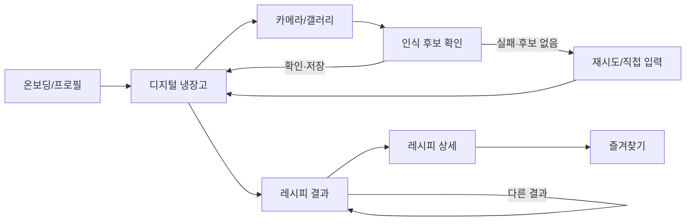

# My Little Chef — 요구사항 및 명세서

**Team 15 · Iteration 1 · 2026-10-09 · v0.3**

**언어:** [English](requirements-and-specifications.en.md)

## 1. 개정 이력

| 버전 | 날짜 | 주요 변경 |
| --- | --- | --- |
| 0.1 | 2026-09-30 | 제안서와 초기 연구를 바탕으로 목표 사용자, 재료 등록, 레시피 추천 요구사항 작성 |
| 0.2 | 2026-10-07 | Android 시제품, 레시피 데이터, TA 피드백을 반영해 1인분 요리와 실제 조리 제약을 구체화 |
| 0.3 | 2026-10-09 | 필수 사용자 스토리 6개와 후보 기능을 구분하고 화면 흐름을 정리 |

## 2. 프로젝트 요약

My Little Chef는 자취생과 1인 가구가 **지금 가진 재료와 조리도구로 한 끼를 만들 수 있는지** 판단하도록 돕는 Android 앱이다. 사용자는 식재료 사진을 찍거나 갤러리에서 골라 인식 후보를 받고, 잘못된 후보를 지우거나 직접 입력한 뒤 디지털 냉장고에 저장한다. 앱은 확인된 재료, 알레르기 정보, 사용 가능한 조리도구를 바탕으로 레시피를 찾고, 바로 만들 수 있는 요리와 추가 재료·도구가 필요한 요리를 구분해 이유를 보여준다. 레시피 상세 화면은 출처, 재료량, 조리 순서와 1인분 기준의 적용 여부를 알려준다. 목표는 재료 등록의 수고를 줄이면서도 인식 오류로 잘못된 추천이 나오지 않도록 사용자의 확인 단계를 유지하는 것이다. Iteration 1에서는 Android 화면 흐름과 로컬 레시피 DB를 각각 만들었다. 사진 인식, 서버 추천, 1인분 변환, 도구·알레르기 필터가 연결된 서비스는 아직 구현되지 않았다.

## 3. 고객과 사용 상황

- **일반 고객:** 집에 있는 식재료로 만들 요리를 찾는 사람.
- **핵심 고객:** 냉장고가 작고 재료·조리도구가 제한된 대학생 자취생과 1인 가구. 한 번에 많은 양을 만들거나 복잡한 조리법을 따르기 어려울 수 있다.
- **주요 상황 A:** 냉장고를 열었지만 무엇을 만들지 떠오르지 않는다. 사진으로 재료 등록을 시작해 실제 가능한 한 끼를 찾는다.
- **주요 상황 B:** 새 식재료 몇 개를 샀다. 전체 냉장고를 다시 입력하지 않고 해당 재료만 추가하거나 잘못 등록된 항목을 고친다.
- **제약이 있는 고객:** 알레르기나 조리도구 제한이 있는 사람. 정보가 확인되지 않은 레시피를 안전하다고 단정해서는 안 된다.

제품의 차별화 목표는 사진 인식 자체가 아니라 **낮은 등록 부담과 1인 가구의 실제 조리 가능성 판단을 함께 제공하는 것**이다. 조리도구, 핵심 재료, 1인분 기준, 누락된 조건을 사용자에게 명확히 보여주는 경험을 지향한다.

## 4. 경쟁 서비스와 위치

| 항목 | Samsung Food | 냉고 | My Little Chef의 목표 |
| --- | --- | --- | --- |
| 보유 식재료 목록과 재료 기반 검색 | 공식 도움말에서 확인됨 | 앱 소개에서 재료 기반 AI 추천을 안내 | 확인된 재료를 기준으로 추천하고 부족한 조건을 설명 |
| 사진을 통한 재료 등록 | 공식 도움말에서 확인됨 | 앱 소개에서 사진·텍스트 입력을 안내 | 인식 후보를 저장 전에 수정·삭제·직접 추가 |
| 레시피 개인화 | Food+에서 AI 개인화를 안내 | AI 추천을 안내 | 1인분·조리도구·핵심 재료를 함께 고려하는 좁은 사용 사례에 집중 |
| 조리도구와 알레르기 제약 처리 방식 | 이 비교에서는 확인하지 않음 | 이 비교에서는 확인하지 않음 | 검증된 정보가 있을 때만 ‘바로 조리 가능’ 또는 ‘안전’으로 표시 |

기존 서비스에도 사진 등록, 재료 기반 탐색, AI 추천과 1인 가구 대상 설명이 있으므로 이를 독점적 기능으로 주장하지 않는다. 위 표의 ‘목표’ 열은 아직 완성된 기능이 아니다. 비교 근거: [Samsung Food의 Food List 안내](https://support.samsungfood.com/hc/en-us/articles/30025317487508-Getting-Started-with-Food-List), [재료 기반 검색 안내](https://support.samsungfood.com/hc/en-us/articles/30251599415956-How-to-Search-for-Recipes-Using-Your-Available-Ingredients), [Food+ 소개](https://samsungfood.com/food-plus/), [냉고 Google Play 소개](https://play.google.com/store/apps/details?id=com.naengo.app). 2026-10-09 기준으로 확인했다.

## 5. 기능 요구사항

아래 **US-01~US-06은 프로젝트 종료 시 구현할 필수 사용자 스토리의 제안**이다. 수업 지침에 따라 최종 사용자 스토리에 적힌 기능은 프로젝트 종료 시 모두 구현해야 하므로, 팀이 구현 범위를 확정하면서 좁히거나 수정할 수 있다. 인수 기준은 각 기능의 완료 여부를 판단하기 위한 관찰 가능한 상황이다.

### US-01. 조리 제약 설정

**자취생으로서**, 내가 가진 조리도구와 알레르기 정보를 저장하고 싶다. **그래야** 만들 수 없는 요리를 가능한 요리로 오해하지 않는다.

- **Given** 처음 앱을 사용하는 사람이 조리도구와 알레르기 항목을 선택했다. **When** 저장을 누른다. **Then** 선택한 정보가 프로필에 표시되고 앱을 다시 열어도 유지된다.
- **Given** 저장된 정보가 있다. **When** 사용자가 항목을 수정하고 레시피를 다시 요청한다. **Then** 새 조건으로 결과가 갱신된다.
- 알레르기 정보가 누락된 레시피는 ‘검증된 안전 레시피’로 표시하지 않는다.

### US-02. 사진 인식 결과 확인

**냉장고에 재료가 있는 사용자로서**, 사진에서 찾아낸 재료 이름을 저장 전에 확인·수정하고 싶다. **그래야** 잘못 인식된 식재료가 냉장고 목록과 추천에 반영되지 않는다.

- **Given** 사진 분석이 후보 목록을 반환했다. **When** 사용자가 후보를 지우거나 직접 재료를 추가한 뒤 확인한다. **Then** 확인한 항목만 냉장고에 저장된다.
- **Given** 분석이 실패하거나 후보가 없다. **When** 결과 화면이 나타난다. **Then** 재시도와 직접 입력 중 하나를 선택할 수 있다.
- 사진에서 파악하기 어려운 소금·설탕 같은 상비 양념은 별도 체크 목록으로 다룰지 검토 중이며, 현재 필수 흐름으로 확정하지 않았다.

### US-03. 보유 재료 관리

**사용자로서**, 현재 가진 재료를 보고 추가·삭제하고 싶다. **그래야** 추천이 실제 보유 상태를 따른다.

- **Given** 확인된 재료를 저장한다. **When** 냉장고 화면을 연다. **Then** 해당 재료가 중복 없이 보인다.
- **Given** 더 이상 없는 재료를 삭제한다. **When** 새 추천을 요청한다. **Then** 삭제한 재료를 가진 것으로 취급하지 않는다.
- 초기 요구사항은 재료의 **보유 여부**를 다룬다. 남은 수량 추적은 입력 부담과 정확도를 비교한 뒤 별도로 결정한다.

### US-04. 조리 가능성을 설명하는 추천

**혼자 요리하는 사람으로서**, 보유 재료·조리도구·알레르기 조건에 맞는 레시피를 보고 싶다. **그래야** 재료 일부만 겹치는 요리를 바로 만들 수 있다고 오해하지 않는다.

- **Given** 필수 재료와 도구가 확인된 레시피가 있다. **When** 추천을 요청한다. **Then** 바로 조리 가능한 요리와 부족한 조건이 있는 요리를 구분하고 이유를 보여준다.
- **Given** 확인된 알레르기 충돌이 있다. **When** 추천 후보를 계산한다. **Then** 해당 요리를 안전한 후보로 제시하지 않는다.
- **Given** 바로 조리 가능한 요리가 없다. **When** 결과 화면을 연다. **Then** 이유를 설명하고 입력 수정 또는 추가 재료가 필요한 요리 탐색 경로를 제공한다.

### US-05. 출처가 있는 1인분 레시피 상세

**요리 초보 사용자로서**, 재료·양·순서·출처와 부족한 조건을 한 화면에서 보고 싶다. **그래야** 실제로 만들지 결정할 수 있다.

- **Given** 레시피 카드를 선택했다. **When** 상세 화면을 연다. **Then** 원본 출처, 재료 목록, 조리 순서, 원본의 인분 수, 누락 재료·도구를 확인할 수 있다.
- **Given** 1인분 변환이 검증된 레시피다. **When** 양을 본다. **Then** 1인분 수치와 원본 수치의 관계가 명확하다.
- **Given** 원본 양이 ‘약간’처럼 모호하거나 인분 정보가 불완전하다. **When** 상세 화면을 연다. **Then** 검증되지 않은 환산량을 확정된 수치로 표시하지 않는다.

### US-06. 마음에 들지 않는 추천 바꾸기와 저장

**사용자로서**, 레시피를 저장하거나 다른 적합한 요리를 보고 싶다. **그래야** 첫 결과가 마음에 들지 않아도 조건을 다시 입력하지 않고 탐색할 수 있다.

- **Given** 여러 적합한 후보가 있다. **When** ‘다른 레시피’ 또는 새로고침을 누른다. **Then** 동일한 안전·도구 조건을 지키면서 다른 후보를 보여준다.
- **Given** 레시피를 즐겨찾기에 저장하거나 해제한다. **When** 즐겨찾기 목록을 연다. **Then** 변경된 상태가 반영된다.
- 새로고침의 상세 순서와 이전 결과 반복 허용 여부는 설계에서 확정해야 한다.

### 아직 필수 스토리로 확정하지 않은 후보 기능

- **AI 레시피 조정:** 유사한 재료 치환 또는 1인분 양 조정을 제안하되 원본과 변경안을 분리해서 보여준다. 알레르기, 필수 재료, 조리도구, 식품 안전 관련 단계는 검증 없이 바꾸지 않는다. TA가 적극적인 AI 활용을 권했지만 허용 치환 범위와 검증 책임이 아직 정해지지 않았다.
- **추가 구매 제안:** ‘재료 하나를 더 사면 가능한 요리’와 관리 방법을 안내하는 방안이다. 추천 기준과 데이터가 정해지면 정식 요구사항으로 바꾼다.
- **상비 양념 체크 목록:** 사진에서 잘 보이지 않는 양념을 초기 설정이나 직접 확인으로 관리하는 방안이다.

## 6. 비기능 요구사항

| ID | 요구사항 | 확인 방법 |
| --- | --- | --- |
| NFR-01 | 알레르기 정보가 불완전한 요리를 검증된 안전식으로 단정하지 않는다. | 알려진 충돌과 정보 미상 사례의 화면 문구 확인 |
| NFR-02 | 인식 후보는 사용자 확인 전 냉장고 재고로 반영되지 않는다. | 후보 삭제·추가·취소·확인 흐름 관찰 |
| NFR-03 | 원본 레시피의 출처와 AI 또는 규칙 기반 변경 제안을 구분한다. | 상세 화면에서 원본과 변경 내역을 비교 |
| NFR-04 | 외부 AI API 키는 Android 앱에 포함하지 않고 서버에서 관리한다. | 저장소와 앱 빌드 설정 점검 |
| NFR-05 | 로딩, 분석 실패, 재료 없음, 추천 없음 상태에서 사용자가 다음 행동을 알 수 있다. | 각 상태의 안내 문구와 버튼 확인 |
| NFR-06 | 사진 분석과 추천 응답 시간을 실제 사용 환경에서 측정한다. | 대표 기기·사진으로 기준선을 만든 뒤 목표 수치 결정 |

## 7. 화면과 사용자 흐름

| 화면 | 허용되는 입력과 행동 | 오류·빈 상태에서의 행동 |
| --- | --- | --- |
| 온보딩·프로필 | 닉네임, 조리도구, 알레르기 선택·수정 | 잘못된 필수 입력은 저장 전에 설명 |
| 디지털 냉장고 | 재료 확인·추가·삭제, 사진 등록 시작 | 재료가 없으면 등록 방법 안내 |
| 카메라·갤러리 | 사진 촬영 또는 선택·분석 요청 | 권한 거부, 사진 선택 취소, 업로드·분석 오류 안내 |
| 후보 확인 | 후보 삭제·직접 추가·저장 | 후보 0개일 때 재시도와 수동 입력 제공 |
| 추천 목록 | 조리 가능 여부·부족한 조건 확인, 다른 결과·즐겨찾기 | 가능한 요리 0개면 이유와 다음 행동 안내 |
| 상세 | 원본 재료·양·순서·출처, 제안된 변경 확인 | 양·안전 정보가 부족하면 해당 한계 표시 |

화면 설계 원본은 [팀 Figma](https://www.figma.com/design/bxDeYMiAzC9LY7oHNj2OQV/my-little-chef?t=4IKrs5VSkKNKfJMZ-1)에 있다.

## 8. Iteration 1 구현 범위와 향후 결정

Android 브랜치는 온보딩, 사진·수동 등록, 후보 확인, 냉장고, 레시피 목록·상세 등의 **목업 흐름**을 보여준다. 분석 화면은 사진에서 재료를 추론하지 않고 미리 정한 후보를 반환한다. 레시피 목록도 실제 537개 DB와 연결되지 않았다. 별도의 SQLite 프로토타입에는 레시피 537개, 단계 2,870개, 재료 701개, 레시피-재료 관계 5,933개가 정리되어 있다. 조리도구·알레르기 관계 테이블은 비어 있다. 연구 브랜치의 비교 수치는 모의 재료 문자열에 대한 진단이며 냉장고 사진 인식 성능이 아니다. 원본 데이터의 레시피 대표 이미지 및 단계 이미지 URL 필드는 사용하지 않는다고 제공처가 답했다.
